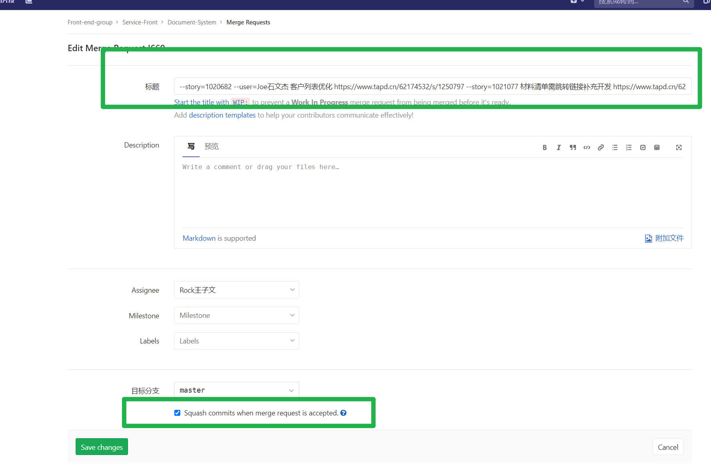

GIT作为代码托管系统，不可避免涉及到多人协作，多人协作必然会诞生一些工作流程，让大家在编码过程中更好的协作。
这里的流程也称为"workflow"，有的地方也称为"分支模式"。

## 工作流(背景)

业内常见的几种工作流

- TBD(Trunk Based Development)

- Git Flow
- Github Flow
- GitLab Flow
- Aone Flow（阿里Aone工作流）

在讲流程之前，要明确分支的概念。在我们日常开发过程中，往往会有一些生命周期比较长的分支，比如：master、dev、release。这些分支都是有语义体现，比如dev用于日常开发使用、release用于发布使用、master就是稳定的主干分支。这些分支都是有特殊意义而保留的，主要分为 主干分支、开发分支、发布分支，具体要看这个分支的用途。业界也会把这种分支管理称为分支模式，举个例子就有：

- 主干开发\分支发布（TBD）

- 分支开发\主干发布（Github实践）
- 分支开发\分支发布（Git实践）
- 支持分支\开发主干发布 and 分支开发\分支发布 都支持（GitLab实践/Aone实践）。

具体详情可以查看这篇文章 https://zhuanlan.zhihu.com/p/456771717

之前技术部实际定的是类似于**Git Flow**的工作流，可这套工作流不适用于**同时间**在**相同REPO**开发**上线日期不同**的功能。
所以之前前端实际采纳的是类似于 Aone Flow 的分支模式，但是又有一点差别。

## Aone Flow（前端借鉴）

为什么借鉴？它解决核心问题：**同时间**在**相同REPO**开发**上线日期不同**的功能。

**AoneFlow 只使用三种分支类型：**

- 主干分支
- 特性分支
- 发布分支

**以及三条基本规则：**

- **规则一：开始工作时，从最新版本的主干分支创建特性分支，通常以feat-前缀开头，然后在这个分支上提交代码修改。**
  
- **规则二：（通过合并特性分支，形成发布分支）这一步是比较核心的地方，Aone其实通过了流水线集成方式，把多个分支就绪好之后（会有个待发布特性分支的池子），合并成一个release前缀的发布分支进行发布。假如此时又一个特性分支要暂停发布，只要踢掉这个特性分支，重新把池子里的特性分支重新合并成新的release发布分支即可。**
  ****
- **规则三.：（发布到线上正式环境后，合并相应的发布分支到主干，在主干添加标签，同时删除该发布分支关联的特性分支）当一条release前缀发布分支上的流水线完成了一次线上正式环境的部署，就意味着相应的功能真正的发布了，此时应该将这条发布分支合并到主干。为了避免在代码仓库里堆积大量历史上的特性分支，还应该清理掉已经上线部分特性分支。这一步如果你用AoneFlow是会在背后帮你自动执行的。**

**了解了Aone Flow是什么后，在来说说我们目前的现状**

- 规则一，我们目前与其**一致**
- 规则二，可以分为两种场景
  - 对于测试环境（**一致**）：我们目前是将特性分支合到staging发布测试。（我们这边这里其实和Aone有点点区别，主要体现在测试发布分支的维护，因为阿里有完善的devops平台。他们的测试发布分支可以随意组装特性分支，而我们只有staging，所以就会有个合入了不能很好的剔除掉不用的特性分支。目前方案可能就是删掉staging，在重新重master拉，但实施难度较大，需要通知到位其它人重写拉staging）。
  - 对于生产环境（**不一致**）：没有遵守规则二的原因主要是发生过几次大家在发布前忘记将最新master合入release。（Aone有平台做这个事，不会有心智负担）。所以我们最后采纳了以下这种方案：
    先将需要当天上线的特性分支合到一个临时release，在将这个临时release合入master，又或者直接将功能分支合入master。然后基于master生成新的发布分支，也就是我们常说的tag，通常以release-[日期]-[版本号]命名（eg：release-v202301122-rc01）。
- 规则三，**不一致**，我们是先合到主干分支，在发布到正式环境。

**目前前端的流程如下所示**

**五种分支类型：**

- 主干分支
- 特性分支
- 发布分支
- 发布tag
- 临时合并分支

**工作流程：**

## 分支命名规范（须遵守）

### 四条产品业务线命名简写

- 中台业务组：middle
- C端智能组：c
- B端交付组：b
- 数字营销组：digital

### 分支命名：

- 主干分支（master）
- 公共测试分支（staging）【历史原因】
- 迭代分支
  - 迭代分支通常是确定某个时间节点一起上线的多个需求一起组成的分支（release/c-1207）这个分支由B端/C端小组长/前端组长创建
  - 迭代分支命名：release/[产品业务线命名简写]-[上线日期] 。 eg: release/middle-1130
  - 一个迭代分支下面会有多个人一起开发，开发者基于该迭代分支切自己的分支来进行开发
  - 开发者分支命名：feat-[产品业务线命名简写]-[上线日期]-[开发者]。eg: feat-middle-1130-steve
- 线上hotfix分支
  - 从master分支拉新的分支开发，分支命名如下
  - 线上问题修复：fix-[功能名]-[开发者]。eg：fix-dwp-data-error-wzw
  - 修复完成merge到staging分支转测试，测试通过后从fix分支提pr（to master）
- 发布tag
  - 生产：release-[产品业务线命名简写]-[上线日期]-[版本号]。eg：release-middle-20231130-rc01
- 临时合并分支 ：release/[产品业务线命名简写]-[上线日期]，合完后删除

## PR规范（须遵守）

**PR提交格式：**

- 提交格式
  
- 提交时机
  建立开发分支后就可以往迭代（或者临时）release分支提交了，便于随时review
- pr通过条件：需要有人review后点赞(review过的可以点个赞，不强制)
  
